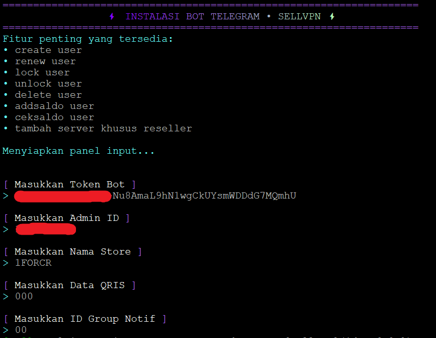
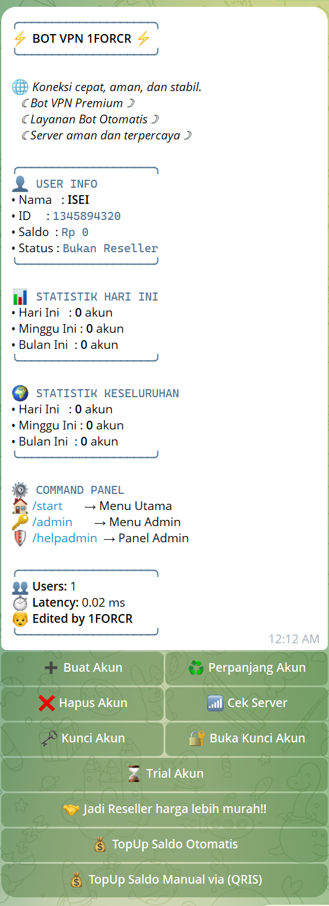

# Ketantech VPN Bot

Bot Telegram untuk manajemen layanan VPN dengan integrasi QRIS dinamis (GoPay autogopay) dan polling mutasi OrderKuota. Mendukung pembelian akun VPN otomatis (SSH, VMess, VLess, Trojan, Shadowsocks), trial, sistem reseller, deposit saldo, dan backup database terjadwal.

## Instalasi

Rekomendasi OS: Ubuntu 24 LTS atau Debian 12.

```bash
git clone https://github.com/ketanvpn/ketantechvpn.git /root/BotVPN
cd /root/BotVPN
npm install
cp .env.example .env
# edit .env & .vars.json
pm2 start ecosystem.config.js
pm2 save
```

Checklist deploy VPS baru lengkap ada di [DEPLOY.md](./DEPLOY.md).

## Fitur Utama

### Untuk User
- Pembelian akun VPN otomatis (SSH, VMess, VLess, Trojan, Shadowsocks)
- Sistem deposit saldo dengan bonus top up bertingkat
- Pembayaran via QRIS dinamis + polling mutasi otomatis
- Trial akun harian dengan batas konfigurasi
- My Accounts: lihat, renew, lock/unlock, delete akun sendiri

### Untuk Admin
- Dashboard admin lengkap via inline keyboard
- Manajemen server, user, saldo, dan reseller
- Tambah server khusus reseller (harga berbeda dari server umum)
- Backup database manual dan otomatis (interval bisa diatur)
- Laporan harian dan pengingat expired
- Broadcast ke semua user / reseller / member
- Cek dan top up saldo user by Telegram ID
- Monitoring transaksi dan cek status server via `cek-port.sh`

### Untuk Reseller
- Akses server khusus dengan harga khusus
- Target aktivitas bulanan + bonus tier otomatis
- Ringkasan penjualan bulanan

## Tampilan Aplikasi

### Menu Awal Instalasi


### Menu Bot


### Menu Admin


## Sistem Pembayaran

### Data QRIS dari Foto QRIS (QRIS statis)
Gunakan tools berikut untuk extract data QRIS:
🔗 https://qreader.online/

### Setup Kredensial Payment

Secrets diisi di `.env` (copy dari `.env.example`). Konfigurasi non-sensitif (tier bonus, scheduler, timezone) tetap di `.vars.json`.

Field utama di `.env`:

- `BOT_TOKEN` — token bot Telegram dari BotFather
- `MASTER_ID`, `ADMIN_IDS` — ID Telegram admin (pisah koma)
- `GOPAY_API_KEY`, `GOPAY_BASE_QR` — kredensial autogopay untuk generate QRIS dinamis
- `ORDERKUOTA_AUTH_USERNAME`, `ORDERKUOTA_AUTH_TOKEN` — cek mutasi OrderKuota
- `MERCHANT_ID` — EMV QRIS merchant untuk fallback manual
- `SOCKS_POOL` — JSON array proxy SOCKS5 untuk polling mutasi (opsional)

Polling mutasi dilakukan langsung dari `app.js` (fungsi `cekQRISGopayHistory`).

## Perubahan Rilis Ini

- Migrasi kredensial ke `.env` dengan `dotenv`, `.vars.json` fokus config non-sensitif.
- `spawn('bash', ['cek-port.sh'])` menggantikan `exec` shell string (aman dari injection).
- Validasi identifier SQL di helper DDL (`ensureSqliteColumn`, `createUniqueIndexIfSafe`).
- `bot.catch` + graceful shutdown `SIGINT`/`SIGTERM` untuk PM2 restart bersih.
- Encoding UTF-8 dirapikan untuk semua emoji.
- File tidak terpakai dihapus: `api-cekpayment-orkut.js`, `services/`, `modules/change-ip.js`, `app2.js`.

## Lisensi

Untuk pemakaian internal Ketantech. Tidak untuk redistribusi publik tanpa izin.
